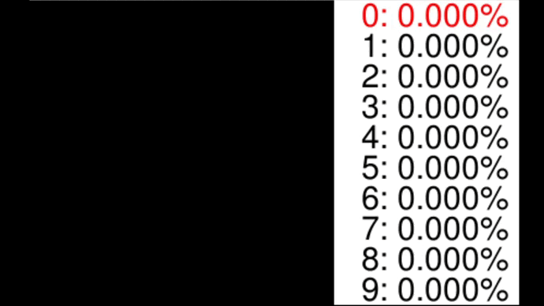

# DigitIdentifier
DigitIdentifier is a deep neural network implementation using only numpy (fully connected layers only). 
The network is trained by backpropagation. In the current setting it is trained on the MNIST digit dataset. 
Furhtermore, the dataset is scaled, translated, rotated and noised randomly in order to provide a network that is capable of recognizing user drawn digits. 
This implementation could also be used for other 2d canvas recognition tasks, such as doodles or letters. 




## Features
<ul>
<li>Deep neural network state can be loaded/saved from/to a file</li>
<li>Functions to randomly transform training data to increase the accuracy of the network</li>
<li>Drawable PyGame canvas in order to give real-time network feedback on user input</li>
<li>Comes with commonly used cost and activation functions and can be easily extended</li>
</ul>

## Installation
Clone the DigitIdentifier repository and change to project directory:
```bash
git clone git@github.com:Topxic/DigitIdentifier.git
cd DigitIdentifier
```
Install the required dependencies:
```bash
pip install -r requirements.txt
```

## Usage
Run the DigitIdentifier script:
```bash
python3 ui.py
```
First the training data is transformed randomly and stored to a file. Next, the network is created and trained on the data. 
The canvas opens up as soon the training is finished. Both network and training data are persisted after being created.
